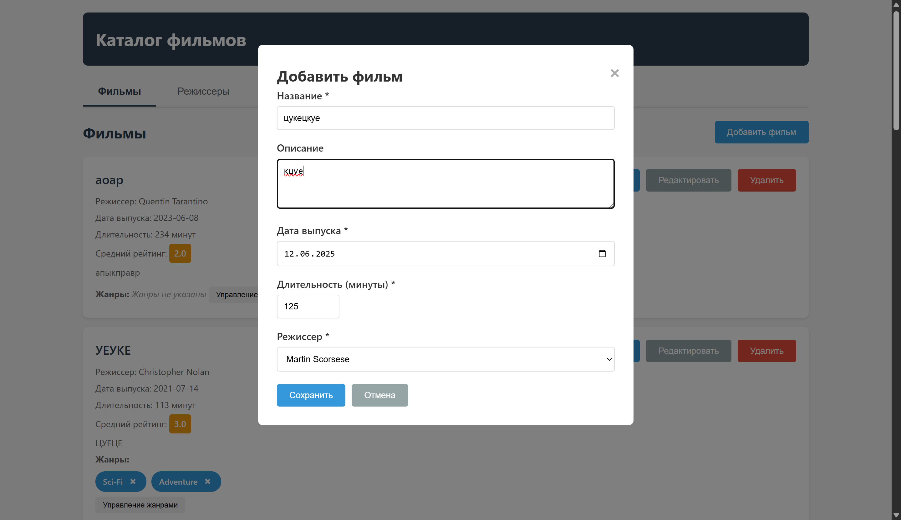
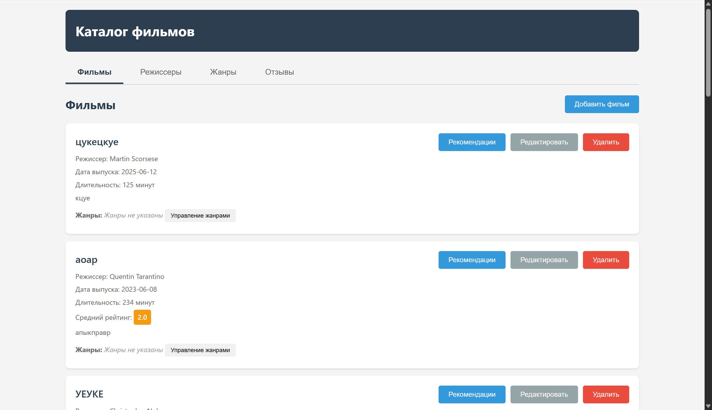

# Лабораторная работа №1

Автор - Евтович Марко ИУ6-52Б

## Главная сущность - Movie

Содержит в себе информацию о фильме:

* Название фильма
* Описание фильма
* Дата выхода
* Продолжительность (в минутах)
* Режиссер (связь с сущностью Director)
* Жанры (множественная связь с сущностью Genre)
* Отзывы (связь с сущностью Review)
* Средний рейтинг (вычисляется на основе отзывов)

Таким образом, данная сущность является центральной в системе и связывает все остальные сущности: режиссеров, жанры и отзывы.

## Взаимодействие

Для работы с приложением реализован RESTful API и веб-интерфейс:

### Создать фильм

```bash
POST /api/movies
```

Отправляет на сервер запрос `POST` `/api/movies` с телом:

```json
{
    "title": "Название фильма",
    "description": "Описание фильма",
    "releaseDate": "2024-01-15",
    "duration": 120,
    "directorId": 1,
    "genreIds": [1, 2]
}
```

### Получить все фильмы

```bash
GET /api/movies
```

Возвращает список всех фильмов с их режиссерами, жанрами и средним рейтингом.

### Получить фильм по ID

```bash
GET /api/movies/{id}
```

Возвращает информацию о конкретном фильме.

### Обновить фильм

```bash
PUT /api/movies/{id}
```

Отправляет на сервер запрос `PUT` `/api/movies/{id}` с телом аналогичным созданию фильма.

### Удалить фильм

```bash
DELETE /api/movies/{id}
```

Удаляет фильм и все связанные с ним отзывы.

### Получить рекомендации по фильму

```bash
GET /api/movies/{id}/recommendations
```

Возвращает список похожих фильмов на основе общих жанров.

### Работа с режиссерами, жанрами и отзывами

Доступны стандартные CRUD операции:
* `GET /api/directors` - получить всех режиссеров
* `POST /api/directors` - создать режиссера
* `GET /api/genres` - получить все жанры
* `POST /api/genres` - создать жанр
* `GET /api/reviews` - получить все отзывы
* `POST /api/reviews` - создать отзыв
* `GET /api/reviews/movie/{movieId}/average-rating` - получить средний рейтинг фильма

## Запуск

### Фронтенд

Для работы с приложением через веб-интерфейс откройте в браузере:

```
http://localhost:8080
```

Веб-интерфейс позволяет:
* Просматривать список фильмов, отсортированных по дате выхода
* Создавать, редактировать и удалять фильмы
* Управлять режиссерами и жанрами
* Добавлять и удалять жанры у фильмов
* Просматривать и создавать отзывы
* Получать рекомендации похожих фильмов

### Бэкенд

Для запуска бэкенда необходимо:

1. **Настроить Java 21:**

Для Windows (PowerShell):
```powershell
.\setup_java21.ps1
```

Для Linux/macOS:
```bash
export JAVA_HOME=/usr/lib/jvm/java-21-openjdk
export PATH=$JAVA_HOME/bin:$PATH
```

2. **Настроить базу данных:**

Для Windows (PowerShell):
```powershell
.\setup_database.ps1
```

Для Linux/macOS:
```bash
chmod +x setup_database.sh
./setup_database.sh
```

Скрипт предложит выбрать:
* **Вариант 1**: Использование локальной установки PostgreSQL
* **Вариант 2**: Использование Docker контейнера

Параметры базы данных по умолчанию:
* **Database Name**: `movieCatalog`
* **User**: `admin`
* **Host**: `localhost`
* **Port**: `5432`
* **Password**: `admin`

3. **Запустить приложение:**

**Сборка:**
mvn clean install
**Запуск:**
mvn spring-boot:run

В качестве БД используется PostgreSQL. В файле `/src/main/resources/application.properties` указаны параметры БД:
* порт (5432)
* логин пользователя (admin)
* пароль пользователя (admin)
* название базы данных (movieCatalog)

## Тестирование

Для запуска unit-тестов выполните:

```bash
mvn test
```

Для запуска конкретного тестового класса:

```bash
mvn test -Dtest=MovieServiceTest
mvn test -Dtest=ReviewServiceTest
```

Тесты покрывают:
* CRUD операции для фильмов
* Создание и управление отзывами
* Расчет среднего рейтинга фильма
* Обработку ошибок (ресурс не найден, валидация)

На рисунке 1 и 2 показан пример работы веб-интерфейса:


